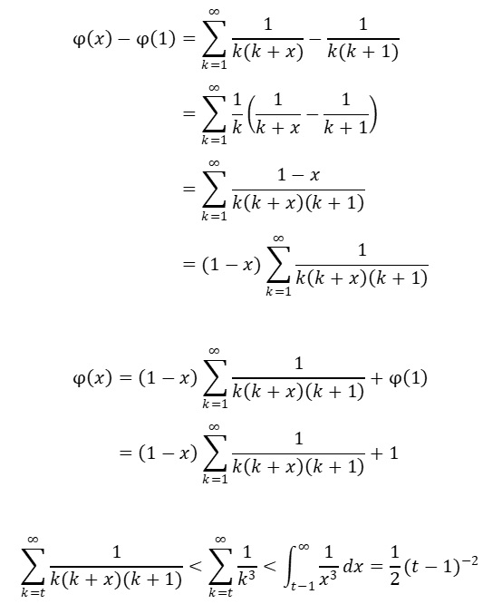

# ZOJ
My ZOJ solutions

## 1001 A + B Problem

[Problem description](http://acm.zju.edu.cn/onlinejudge/showProblem.do?problemCode=1001)

[C++ (Accepted)](https://github.com/Heliovic/ZOJ/blob/master/1001/main.cpp)

## 1002 Fire Net

[Problem description](http://acm.zju.edu.cn/onlinejudge/showProblem.do?problemCode=1002)

[C++ (Accepted)](https://github.com/Heliovic/ZOJ/blob/master/1002/main.cpp)

### 解题思路

递归回溯 + 剪枝。

递归出口：k = N * N + 1

每次递归使用 `check()` 判断是否要剪枝。

* 注意从二维数组第 k 个元素转换到行号列号的技巧
```
        int r = k / N + 1;
        int c = k % N + 1;
```
* 注意 debug 时使用 `print_map()`
* 注意回溯法的**初始化**

## 1004 Anagrams by Stack

[Problem description](http://acm.zju.edu.cn/onlinejudge/showProblem.do?problemCode=1004)

[C++ (Accepted)](https://github.com/Heliovic/ZOJ/blob/master/1004/main.cpp)

### 解题思路

DFS + stack。

设置原字符串下标 src_ptr 和目标字符串下标 tgt_ptr。

每次 DFS 递归时，作如下判断：

1. 若 src_ptr 已达到原串末尾，且 tgt_ptr 已达到原串末尾，且栈内没有剩余元素，说明该序列已达到了一个可行解。
2. 若栈不为空，且栈顶元素等于 tgt_ptr 所指的字符，则又有两种选择：将当前栈顶弹栈，tgt_ptr++，或将当前 src_ptr 所指元素入栈。（tgt_ptr < len，src_ptr < len）
3. 若以上两条都不满足，则将 src_ptr 所指元素入栈。（src_ptr < len）

## 1005 Jugs

[Problem description](http://acm.zju.edu.cn/onlinejudge/showProblem.do?problemCode=1005)

[C++ (Accepted)](https://github.com/Heliovic/ZOJ/blob/master/1005/main.cpp)

### 解题思路

模拟。

倒水问题。用一个杯子装满，不断倒入另一个容积更大的杯子，容积更大的杯子装满时，则清空大杯子，如此循环，必会达到某个体积。

## 1006 Do the Untwist

[Problem description](http://acm.zju.edu.cn/onlinejudge/showProblem.do?problemCode=1006)

[C++ (Accepted)](https://github.com/Heliovic/ZOJ/blob/master/1006/main.cpp)

### 解题思路

编码/译码。

## 1007 Numerical Summation of a Series

[Problem description](http://acm.zju.edu.cn/onlinejudge/showProblem.do?problemCode=1007)

[C++ (Accepted)](https://github.com/Heliovic/ZOJ/blob/master/1007/main.cpp)

### 解题思路

数学计算。

公式变形和确定计算到的最大 k 的过程如下：



## 1009 Enigma

[Problem description](http://acm.zju.edu.cn/onlinejudge/showProblem.do?problemCode=1009)

[C++ (Accepted)](https://github.com/Heliovic/ZOJ/blob/master/1009/main.cpp)

### 解题思路

模拟。

## 1010 Area

[Problem description](http://acm.zju.edu.cn/onlinejudge/showProblem.do?problemCode=1010)

[C++ (Accepted)](https://github.com/Heliovic/ZOJ/blob/master/1010/main.cpp)

### 解题思路

图形学。求线段交点，求平面多边形所围成的面积。
